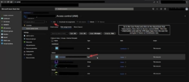

Connecting Azure Stack Hub in Disconnected Mode to the Morpheus Data Platform 

Publication Date: 09 Jun 2023 Applies to: Morpheus Data Version: 6.0+

Categories: *<Tags to aid in search>*  Classification: Public 

Document ID: *TT230601*

Prerequisites 

To gain the most value from this document, readers should already be familiar with the following concepts: ![ref1]

- Knowledge or concepts; ideally with web links  

Implementation of the concepts in this document requires a Morpheus Data deployment with the following state or conditions: 

- States of Morpheus deployment or constructs, required architecture, ecosystem entities, etc  

Implementation of the concepts in this document requires the following parameters relevant to the Microsoft Azure Stack environment: 

- Azure Stack Management Portal Endpoint, annotated in this document as ***<management>***
- Azure Stack Region, annotated in this document as ***<region>***
- Azure Stack Domain, annotated in this document as ***<fqdn>***

Overview 

e.g. functional description, with lightweight “why” Four Endpoints: 

1. User Portal.  Subscription is created in the User portal. 
1. User Management Endpoint.  Used to deploy resources.  Deploying resources. 
1. Admin Portal.   
1. Admin Management Endpoint.  Used for managing the Azure Stack platform itself:  Resource Providers, Health API, Storage API, etc.  e.g. Building policy. 

Implementation ![ref1]

To connect Azure Stack Hub *in disconnected mode* to the Morpheus Data Platform, follow the steps below: 

1. In the Morpheus web UI, navigate to ***Infrastructure > Clouds*** and then click the + ADD button 


2. In the CREATE CLOUD modal, select AZURE STACK (PRIVATE) and then click the NEXT button. 


3. In the CREATE CLOUD modal, use the table below to provide values on the CONFIGURE tab.  See the footnotes of each value for contextual information and examples. 


|IDENTITY URL 1 |https://adfs.<region>.<fqdn> |
| - | - |
|MANAGEMENT URL 2|https://<management>.<region>.<fqdn> |
|IDENTITY RESOURCE URL 3|Value of audiences key, from REST call |
|BASE DOMAIN 4|<Base domain of the Azure Stack deployment> |
|SUBSCRIPTION ID 5|<Found in the User Portal> |
|TENANT ID 5|<p>adfs  </p><p>(all lower case) </p>|
|CLIENT ID 6|<Derived from the Service Principal Name (SPN)> |
|CLIENT SECRET 6|< Derived from the Service Principal Name (SPN)> |
|LOCATION 7|<Selected after authentication is successful> |
|RESOURCE GROUP 7|<Selected after authentication is successful> |

1 IDENTITY URL ![ref2]https://adfs.<region>.<fqdn> 

For an Azure Stack in disconnected mode, the Identity URL, or Login URL, will generally follow the format ***https://adfs***.***<region>***.***<fqdn>***, replacing ***<region>*** and ***<fqdn>*** as appropriate in your environment.  If unsure of the values for ***<region>*** and ***<fqdn>*** in your specific environment, contact your ADFS or Azure Stack administrator. 

2 MANAGEMENT URL.   https://<management>.<region>.<fqdn> 

Replace all variables as appropriate in your environment.  If unsure of these values in your specific environment, contact your ADFS or Azure Stack administrator. 

3 IDENTITY RESOURCE URL.   

To find the Identity Resource URL, send a REST call to or CURL the following API endpoint: 

https://***<management>***.***<region>***.***<fqdn>***/metadata/endpoints?api-version=2015-01-01

In the API call, replace all variables as appropriate in your environment.  If unsure of these values for your specific environment, contact your Azure Stack administrator.  Note that the API version might differ, depending on the specific Azure Stack deployment. 

https://**management**.**westus1**.**contoso.local**/metadata/endpoints?api-version=2015-01-01

The response from the API call will include an authentication stanza with an audiences key.  The value of the audiences key, without the quotes, should be used for the IDENTITY RESOURCE URL.  

  Note that the loginEndpoint can be used to validate your IDENTITY URL. 


```
{
  "galleryEndpoint":"https://adminportal.local.azurestack.external:30015/", 
  "graphEndpoint":"https://graph.windows.net/", 
  "portalEndpoint":"https://adminportal.local.azurestack.external/", 
  "**authentication**":{ 
  "loginEndpoint":"https://adfs.windows.net/", 
  "audiences":["https://contoso.onmicrosoft.com/4de154de-f8a8-4017-af41-df619da68155"] 
  }
}
```

4 BASE DOMAIN![ref2]

For the BASE DOMAIN parameter, use the base domain of the Azure Stack deployment; this is likely the ***<fqdn>*** in your Azure Stack environment.  If unsure of this value for your specific environment, contact your Azure Stack administrator. 

5 SUBSCRIPTION ID![ref2]

The  SUBSCRIPTION  ID  is  found  under  the  AzureStack  Hub  subscription  on  the   Microsoft AzureStack Hub User Portal. 



CLIENT ID and CLIENT SECRET.  6 

The CLIENT ID and the CLIENT SECRET in an Azure Stack disconnected environment are derived from a Service Principal Name in the User Portal or Admin portal.  Note that the SPN must have either Owner or Contributor permissions to Azure the subscription. 

LOCATION and RESOURCE GROUP.  7

The LOCATION and RESOURCE GROUP can be configured after successful authentication to your Azure Stack environment. 

Verification 

internal verification, external verification, lightweight troubleshooting steps, etc ![ref1]

Caveats and Additional Information 

e.g. mutually-exclusive configuration options; reliance on external entities or on-box services, etc  ![ref1]

Further Reading and Documentation 

e.g. navigable content – URL’s to whitepapers or collateral or toolkit, links to textbooks or blogs, etc.  


[ref1]: files/Aspose.Words.3a23d1de-3194-4a4a-941d-ea5324283dee.003.png
[ref2]: files/Aspose.Words.3a23d1de-3194-4a4a-941d-ea5324283dee.012.png
